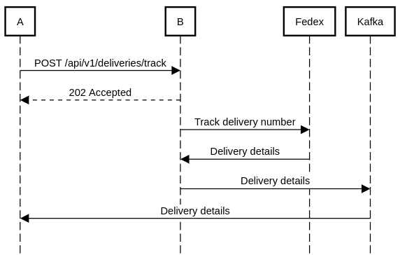

# Deliveries

## Diagrama de secuencia

## Consideraciones y posibles mejoras
- Los flujos asíncronos muchas veces incluyen endpoints para consultar el estado de la request inicial. Podría incluirse uno, preferentemente implementado con Redis para persistir el estado.
- En un caso real deberían incluirse logs.
- Se asumió que el microservicio B es también encargado de la persistencia de deliveries en la base de datos.
- Los datos persistidos del delivery son los considerados importantes. En caso de incluir las direcciones debería hacerse un análisis si las mismas se persistirían como una relación o un modelo embebido.
- Se incluye dos tipos de reintentos en caso de que el servicio de Fedex falle. Uno a nivel servicio, el cual es instantaneo. Uno recursivo a nivel worker, el cual puede esperar un periodo determinado.
- Los reintentos a nivel worker no poseen límite de reintentos, ya que se considera que es fundamental la obtención de respuesta del servicio.

